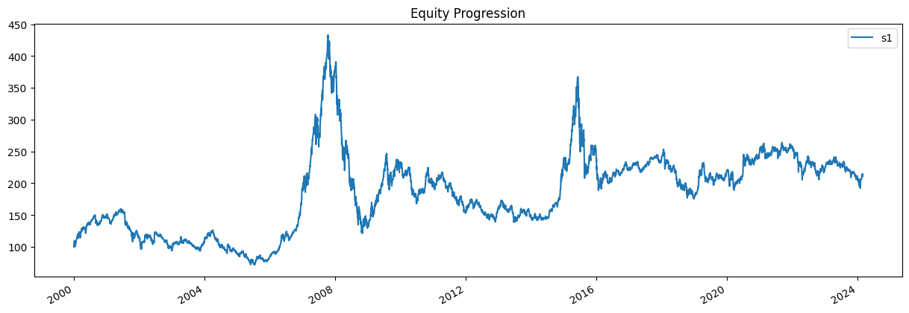
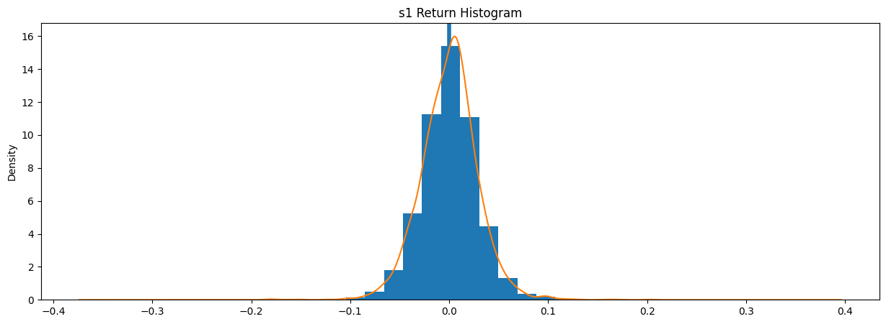
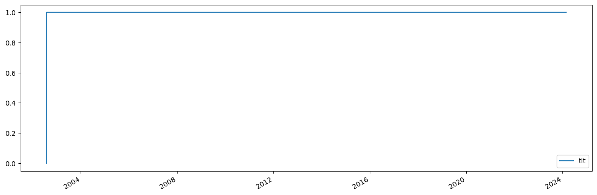
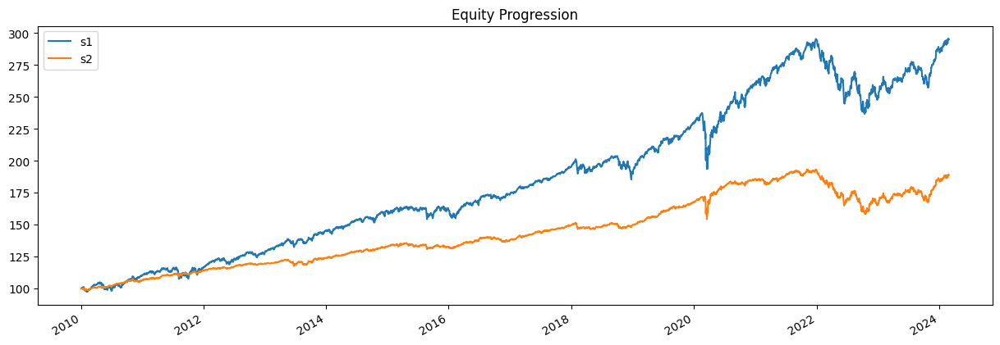

```python
import bt
```


```python
%matplotlib inline
```


```python
data = bt.get('000001.SS', start='2000-01-01')
```

    [*********************100%%**********************]  1 of 1 completed


```python
print(data.head())
```

                   000001ss
    Date                   
    2000-01-04  1406.370972
    2000-01-05  1409.682007
    2000-01-06  1463.942017
    2000-01-07  1516.604004
    2000-01-10  1545.112061


```python
# create the strategy
s = bt.Strategy('s1', [bt.algos.RunMonthly(),
                       bt.algos.SelectAll(),
                       bt.algos.WeighEqually(),
                       bt.algos.Rebalance()])
```


```python
# create a backtest and run it
test = bt.Backtest(s, data)
res = bt.run(test)
```


```python
# first let's see an equity curve
res.plot();
```


    

    


```python
# ok and what about some stats?
res.display()
```

    Stat                 s1
    -------------------  ----------
    Start                2000-01-03
    End                  2024-03-01
    Risk-free rate       0.00%
    
    Total Return         114.33%
    Daily Sharpe         0.26
    Daily Sortino        0.41
    CAGR                 3.21%
    Max Drawdown         -71.98%
    Calmar Ratio         0.04
    
    MTD                  -0.03%
    3m                   -0.57%
    6m                   -3.80%
    YTD                  1.32%
    1Y                   -9.00%
    3Y (ann.)            -5.32%
    5Y (ann.)            0.14%
    10Y (ann.)           3.81%
    Since Incep. (ann.)  3.21%
    
    Daily Sharpe         0.26
    Daily Sortino        0.41
    Daily Mean (ann.)    6.06%
    Daily Vol (ann.)     23.53%
    Daily Skew           -0.21
    Daily Kurt           5.35
    Best Day             9.86%
    Worst Day            -8.84%
    
    Monthly Sharpe       0.24
    Monthly Sortino      0.40
    Monthly Mean (ann.)  5.80%
    Monthly Vol (ann.)   24.44%
    Monthly Skew         -0.08
    Monthly Kurt         1.92
    Best Month           27.45%
    Worst Month          -24.63%
    
    Yearly Sharpe        0.20
    Yearly Sortino       0.59
    Yearly Mean          8.58%
    Yearly Vol           42.62%
    Yearly Skew          1.46
    Yearly Kurt          2.47
    Best Year            130.42%
    Worst Year           -65.39%
    
    Avg. Drawdown        -4.99%
    Avg. Drawdown Days   150.84
    Avg. Up Month        5.27%
    Avg. Down Month      -5.01%
    Win Year %           50.00%
    Win 12m %            48.21%


```python
# ok and how does the return distribution look like?
res.plot_histogram()
```


    

    


```python
# and just to make sure everything went along as planned, let's plot the security weights over time
res.plot_security_weights()
```


    

    


```python
# create our new strategy
s2 = bt.Strategy('s2', [bt.algos.RunWeekly(),
                        bt.algos.SelectAll(),
                        bt.algos.WeighInvVol(),
                        bt.algos.Rebalance()])

# now let's test it with the same data set. We will also compare it with our first backtest.
test2 = bt.Backtest(s2, data)
# we include test here to see the results side-by-side
res2 = bt.run(test, test2)

res2.plot();
```


    

    


```python
res2.display()
```

    Stat                 s1          s2
    -------------------  ----------  ----------
    Start                2010-01-03  2010-01-03
    End                  2024-02-28  2024-02-28
    Risk-free rate       0.00%       0.00%
    
    Total Return         195.01%     88.72%
    Daily Sharpe         0.91        0.91
    Daily Sortino        1.41        1.39
    CAGR                 7.94%       4.59%
    Max Drawdown         -19.87%     -18.01%
    Calmar Ratio         0.40        0.25
    
    MTD                  1.60%       1.01%
    3m                   6.81%       5.85%
    6m                   8.96%       7.63%
    YTD                  2.33%       1.52%
    1Y                   15.85%      12.41%
    3Y (ann.)            3.81%       0.93%
    5Y (ann.)            7.74%       4.38%
    10Y (ann.)           7.16%       4.12%
    Since Incep. (ann.)  7.94%       4.59%
    
    Daily Sharpe         0.91        0.91
    Daily Sortino        1.41        1.39
    Daily Mean (ann.)    8.05%       4.62%
    Daily Vol (ann.)     8.82%       5.09%
    Daily Skew           -0.71       -1.09
    Daily Kurt           13.97       27.64
    Best Day             4.77%       2.93%
    Worst Day            -6.63%      -4.66%
    
    Monthly Sharpe       1.00        0.91
    Monthly Sortino      1.83        1.57
    Monthly Mean (ann.)  8.18%       4.73%
    Monthly Vol (ann.)   8.16%       5.17%
    Monthly Skew         -0.32       -0.32
    Monthly Kurt         1.09        3.57
    Best Month           7.57%       6.23%
    Worst Month          -6.68%      -5.48%
    
    Yearly Sharpe        0.86        0.65
    Yearly Sortino       1.88        1.17
    Yearly Mean          7.66%       4.38%
    Yearly Vol           8.94%       6.69%
    Yearly Skew          -1.30       -1.55
    Yearly Kurt          2.24        3.86
    Best Year            19.64%      12.26%
    Worst Year           -15.30%     -14.06%
    
    Avg. Drawdown        -0.85%      -0.49%
    Avg. Drawdown Days   15.38       15.93
    Avg. Up Month        1.89%       1.09%
    Avg. Down Month      -1.96%      -1.18%
    Win Year %           85.71%      85.71%
    Win 12m %            89.94%      86.79%


```python

```
